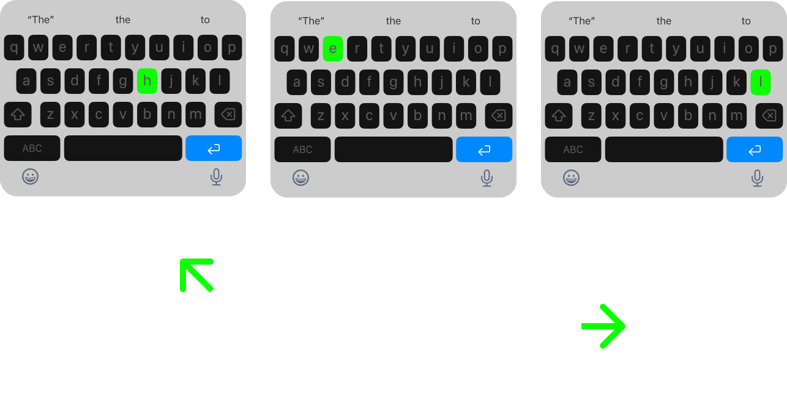

# Gaze

Eyetracking for on-screen keyboards.

Eliminates the need for hand-typing. Infers next letter from eye movements and the context of the sentence.

## On touch typing

The iOS keyboard was invented to dynamically change the size of key hit targets based on the most recently typed letter. For example, if the user types the letter "q", the hit target for the "u" key is enlarged, since the letter "u" is a common letter to type after "q". This helps to reduce the number of mis-typings and makes typing faster and more efficient.

__Gaze typing__ takes this concept a step further by using the direction of the user's eye movement to infer the most likely letter typed. For example, if the user types the letter "q" and then moves their eyes to the right and slightly upwards, the system would infer that the user most likely typed the letter "u". This would be based on the fact that the letter "u" is a common letter to type after "q" and is also located in the same direction as the eye movement.

